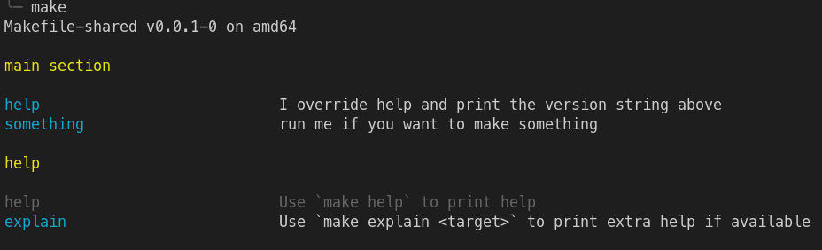

# Makefile-shared

This project aims to provide `include`able files for common use cases in makefiles.

## Quick start

See the [Makefile](Makefile) file in this project, it should provide as easy quick-start.

